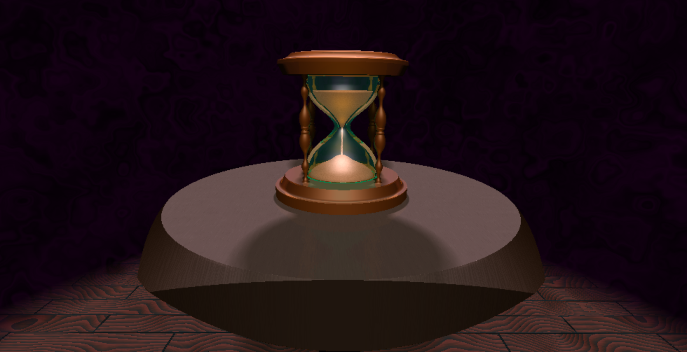
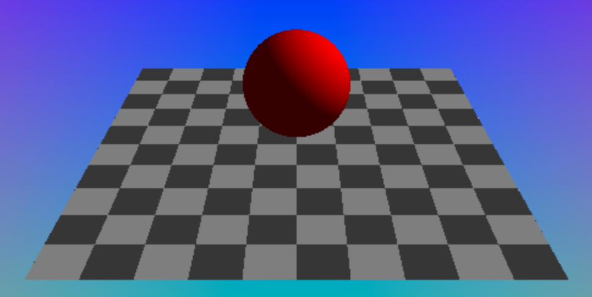
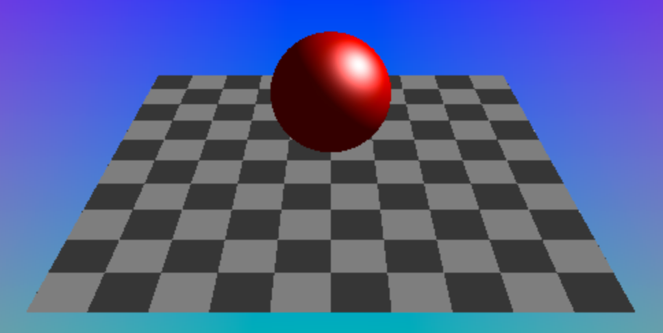
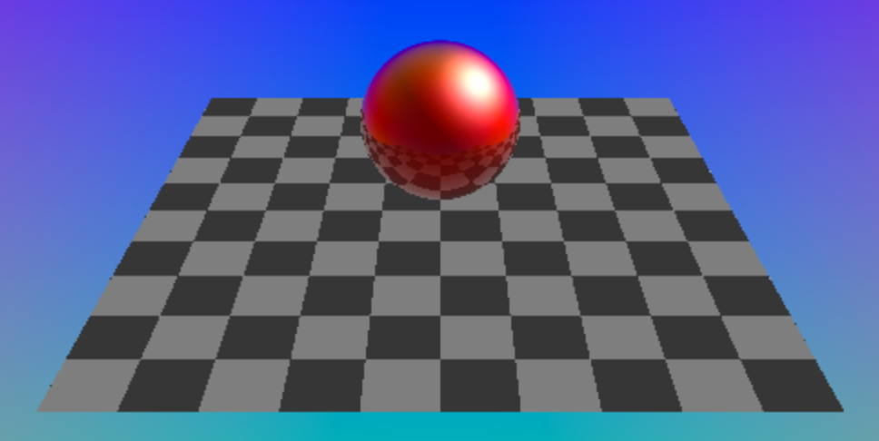
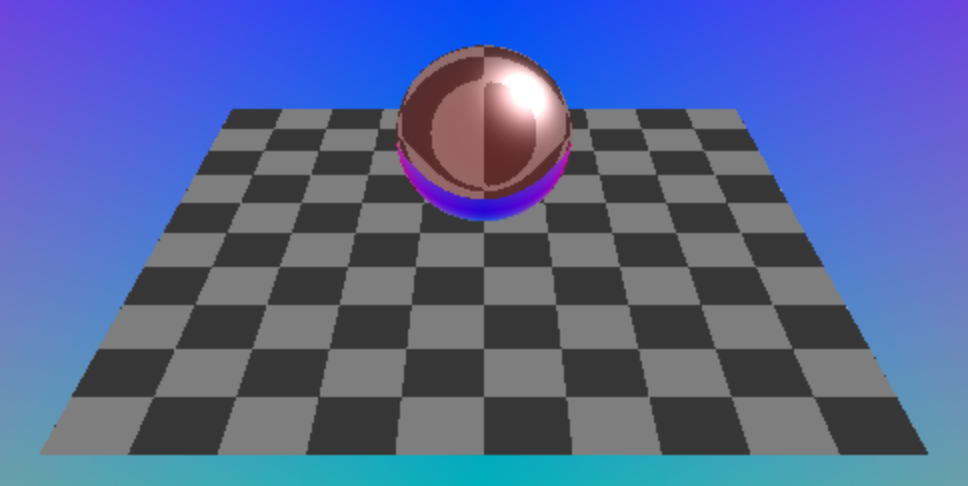

# CIS 566 Homework 3: Environment Setpiece

## Overview
My raymarched scene features an hourglass, with animated sand, on a table in the middle of the shadow realm, or something like that. I didn't really use any external source for inspiration; I started by developing different shaders and the content of my scene evolved from that. I originally hoped to make a well-defined interior space with more detail, but the hourglass itself was so computationally heavy, and getting the different components to play well with each other was so time consuming that I settled for this. Furthermore, my fragment is 1000+ lines, and includes many large functions that are invoked many times. Making the scene larger or more complex would make the shader take too long to compile, to the point where my browsers would just terminate the compilation or crash WebGL (in fact, one of the biggest challenges was optimizing the code just so the entire hourglass could be rendered at once without causing a crash).
The camera controls were not modified whatsoever from the base code. It can be moved around and rotated at will. Keep in mind that zooming in can make the scene take significantly longer to render, however.
The passage of time can be sped up, slowed down, or even reversed. This effects the flow of the sand in the hour glass, as well as the movement of the background.
The scene itself is composed of a variety of SDF primitives, combined through a several different methods,
multiple different materials, and several directional lights. Note that the scene was developed and tested using Firefox 65.0 on MacOS 10.12.6., and was developed locally on my machine, not using ShaderToy.

## Structs
In order to keep my code organized and robust, I introduced a large number of structs that could be used in a variety of situations. These include:
  - SDFData, which is returned by the totalSdf function when raymarching or calculating normals. This contains the distance to the nearest geometry, as usual, but also includes material data (see below) that can be used to color the surface. When a ray gets close enough to geometry to render it, the returned SDFData contains the material data of the closest surface.
  - Surface, which encapsulates the data relating to a point hit by the marched ray. Most importantly, this includes the position the ray hit the surface, the normal at that point, the direction of the ray that hit the surface, and the material of the surface (which is copied from the SDFData). Taken together, this information alone can be used to calculate the color of the fragment.
  - Light, which contains all the data pertaining to a single light (direction, color, etc.) There is a field for the type of light, as I was considering including point lights as well as directional lights, but I was unable to implement this due to time constraints.
  - Material, which contains all the shading data global to the surface (although certain materials are edited after raymarching to add variation across a single surface). Properties include material type (which are all described below), base color, shininess, reflexivity, ior, and attenuation. These properties only apply for certain material types.
  - BoundingBox. This struct includes the center and "radii" of a bouning box, to be used with the bounding box intersection function before a raymarch.

## Geometry
The geometry in the scene is composed of multiple different SDFs, many of which were present in the previous homework. These include spheres, ellipsoids, boxes, capsules, cones, cylinders, etc. As with the previous assignment, I implemented the union, intersection, and difference operators (which can optionally include a smoothing coefficient). I also implemented an inset operator to hollow out an SDF and give it a thickness. In particular;
  - The hourglass was created using a large number of shapes and operations, too many to explain in detail. Basically, the glass was made with 2 cones, and spheres that were smooth-unioned, and them subtracted from boxes to make sure the ends were flat. It was then inset to make it hollow. The stand used several spheres, capsules, ellipsoids and toruses smoothed together, along with cylinders and cones for the bases. Some subtraction was used to add detail. The sand was simply made using smooth-unioned spheres, as wel as some smooth subtraction, and was then intersected with the hull of the glass to make sure it fits inside. The position of these spheres are animated to create the sand emptying from the top into the bottom.
  - The tabletop is simply a box blended with a cylinder with similar dimensions, giving it a rounded appearance, but still with some sharp corners.
  - The floor is simply a box with a small height.
4 bounding boxes were also used to optimize the distance calculation. Unlike my previous assignment, the ray-box intersections are computed outside of the totalSdf function. This allows me to compute the bounding boxes once per raymarch, as opposed to once per raymarch iteration, significantly improving the efficiency of the shader (and preventing some crashes I was getting). Normal calculations also use SDFs, but just test if the point is inside the box, rather than performing the entire ray-box intersection computation. To my surprise, a hierarchical bounding box structure was not necessary, and in fact did not increase the framerate. I tested child bounding boxes wherever I thought they may be useful, but in every case the cost of performing the ray-box intersection and adding a new branch into the total distance function outweighed the benefits of limiting the SDF calculations. Thus, my bounding volume tree is only ever one node deep

## Materials
The bulk of my time was spent working on the different materials in my scene, as there are quite a few of them of varying complexity:
  - There is a simple lambert shader, however, it just calculates the flat color, as the shadow calculation is able to light it as needed, and using both the lambertion shader and the shadow made the objects appear much darker than neccessary. The sand uses a modified lambertian shader that colors the fragments using a high frequency FBM. The noise function of the top half of the sand moves downward to give the appearance that the sand is funneling down (this is easier to see if the time multiplier is increased)
  
  - A simple blinn-phong shader adds the specular highlight to the lambertian color. This highlight is used repeatedly in most other shaders. This shader, along with all the other ones, use normals calculated from the total distance field gradient. The power used in the highlight is determined by the material's shininess. Note that this shader is never actually used directly, but a modified version is used for the wooden floor.
  
  - A glossy shader takes the blinn-phong color, an adds reflections to it. This is done by casting a separate ray after the initial raymarching, with an origin at the hit point, and a direction calculated by GLSL's built in reflect() function. This second ray hits another peice of geometry (or the background), calculates its color, and sets the color of the original surface to that one. However, GLSL doesn't allow for recursion, so I had to duplicate my color calculation function. However, every reflected surface is rendered with either a blinnphong or lambertian shader, as using more complex shaders within the reflection would be too expensive without adding too much to the scene. How reflective a surface is depends on the material's reflexivity value. If it's 1.0, the color is based entirely on the reflection (and the specular highlight). At 0.0, the material might as well be blinn-phong. At 0.5, the blinn phong and full reflective surface are linearly interpolated by the approximated fresnel coefficient (found via a simple dot product).
  
  - The refractive shader was by far the most difficult shader to implement, and took many different steps: 
    -After the initial raycast, another ray is cast, which has an origin at the hit point, and its direction is determined with GLSL's refract() function, using the material's index of refraction value (note that I originally didn't know that this method existed, so I manually calculated the refraction vector, which was a terrible experience that I would not recommend to anyone). At small angles, in certain situations, the implementation of refract() runs into imaginary numbers, so it returns the zero vector, creating rings of black in some surfaces. To rememedy this, I check if this happens, then I calculate the vector manually, clamping the negative radicand to 0. It's not perfect, but I determined that it's good enough for the purposes of this assignment.
    - This cast ray should, except in certain edge cases, be traveling through the refractive object at this point, it stops when it hits the other side of the surface.
    - Another ray is cast, also using the refract() function. Because it's leaving the medium, the ior is inversed during this computation. The resulting ray will then hit another surface, and the color of the fragment will be determined from there.
      - Like the glossy shader, these "recursively" calculated colors are simplified to avoid even more complexity. However, as it is an integral part of my scene, I did implement another "recursive" refractive call. This allows you to see through both layers of the hourglass, both of which are refractive.
    - I can easily calculate the distance the ray went through the refractive object by looking at where the first 2 rays hit. - I use the inverse exponential of this distance (along with the material's attenuation value) to mix the refracted color with the base color. This gives the objects some sort of turbidity that increases realistically at certain angles. It is most easily seen at the edges of the hourglass, where the glass appears more green than anything else (as is true with actual glass).
    
  - Some other shaders based on the previous ones were created to add procedural textures and perturb normals based on them. These include:
    - The sand, which was decribed above
    - The wood table. An FBM was stretched out along a single axis, and was then used to modify the color and normals of the fragments. The normal perturbence can be seen in the reflection if you look clostly.
    - The wood floor. The different planks were calculated as offset cells. The seed of all the other noise and toolbox functions then use the corner of each plank to make them appear separate. First, a simple 1-dimensional sawtooth function is calculated. It's perturbed using some stretched FBM to give the planks a basic wood texture. Another higher frequency FBM is then stretched out and overlaid across the planks to add some grainy detail (similarly to the table). Note that this grain is also perturbed using the same perturbance used to warp the sawtooth. The output value is then used as an iterpolation in a cosine color pallette, and is used as a bump-map. Unlike the table though, the floor is just a blinn-phong.

## Lighting
The scene consists of 3 directional lights. Each light has its own direction, intensity, and color. 2 of these lights are coming from the sky at 45 degrees, and light the scene with a faintly purple tint, to mimic environmental lighting. A third, faint, orange light from below imitates backlight coming from the floor and table. The first two lights cast soft shadows, using the method described by IQ. Note that the light raymarching used to compute the shadows also uses the bounding volume, but because the shadow penumbra relies on the global distance field, I increased the size of the bounding boxes for these calculations in particular (otherwise, it appears that the bounding boxes, rather than the geometry itself, is casting the shadows). The third light also technically casts the shadow of the floor, but because the shadow computations are additive (the "lightness" of each fragment starts out at 0 and increases for every unblocked light), it isn't noticable, which I'm content with. Also, I gave all the shadows a very subtle yellow tint so they contrast more with all the purple in the scene.

## Referenced Sources
- IQ's blog on SDFs (https://www.iquilezles.org/www/articles/distfunctions/distfunctions.htm)
- IQ's blog on raymarched shadows (https://iquilezles.org/www/articles/rmshadows/rmshadows.htm)
- This other SDF blog post, which covers some techniques in slightly more depth than IQ (http://jamie-wong.com/2016/07/15/ray-marching-signed-distance-functions/)
- I referred to certain bits of this tutorial (https://www.scratchapixel.com/lessons/3d-basic-rendering/introduction-to-shading/reflection-refraction-fresnel) for help with calculating my refraction and reflection. At first I didn't realize GLSL had a built-in function to calculate the transmission and reflection vectors, so I used this site to figure out how to calculate them manually. Even after I learned of the true power of GLSL and its built-ins, there were still cases where the implementation would run into square roots of imaginary numbers, so I still used the math here to get a good enough approximation.

## Live Demo
https://sgalban.github.io/hw03-environment-setpiece/
(Note that despite my optmizations, it's still a heavy shader, with many SDFs and complex shaders. On my machine, it runs at about 30FPS before moving the camera when the browser window is at 25% total screen size).